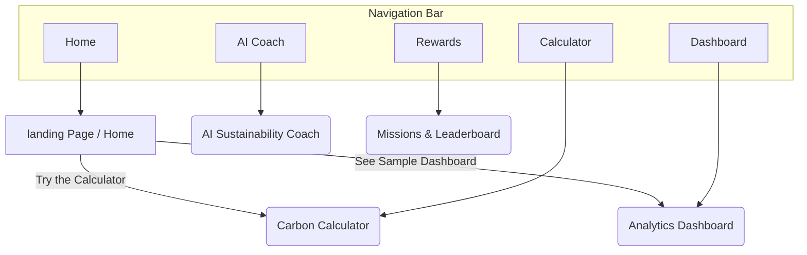
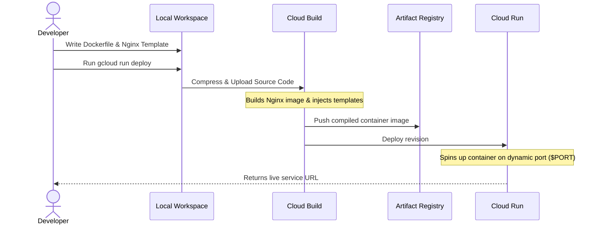

# 🌿 EcoTrack AI — Measure Today. Improve Tomorrow.

[](https://ecotrack-ai-43006172906.us-central1.run.app)
[](#tech-stack)
[](#deployment)

EcoTrack AI is a premium, lightweight, single-page application (SPA) designed to help individuals measure, understand, and reduce their personal carbon footprints. By combining a step-by-step intake calculator, visual emission analytics, mock AI-driven sustainability coaching, and rewarding eco-challenges, it turns sustainability into a structured, engaging habit.

---

## 🗺️ Application Architecture & Navigation

The application operates as a single-page app (SPA) that manages sections dynamically using vanilla JavaScript. Below is the navigation and state flow:



---

## 🧮 Emission Calculation Pipeline

The core calculation logic runs entirely client-side. It takes input from transportation, home energy, diet, and shopping habits, translates them using standard carbon emission factors, and generates a personalized annual carbon footprint score.

```mermaid
flowchart TD
    subgraph User Inputs
        in_trans[Transport Mode & Daily Km]
        in_elec[Electricity kWh / month]
        in_gas[Gas usage: Low/Med/High]
        in_diet[Diet: Veg/Mixed/Meat]
        in_shop[Shopping: Rare/Occasional/Frequent]
    end

    subgraph Calculation Engine
        in_trans --> calc_trans[Daily Km * 365 * Mode Factor]
        in_elec --> calc_elec[Monthly kWh * 12 * 0.45]
        in_gas --> calc_gas[Gas Factor: 0.2, 0.5, or 0.9]
        in_diet --> calc_diet[Diet Factor: 0.9, 1.7, or 2.5]
        in_shop --> calc_shop[Shopping Factor: 0.2, 0.5, or 1.0]

        calc_trans --> sum[Sum all emissions in tCO₂/year]
        calc_elec --> sum
        calc_gas --> sum
        calc_diet --> sum
        calc_shop --> sum
    end

    subgraph Feedback & Action
        sum --> score{Is Score > 6.0 tCO₂?}
        score -->|Yes| high_msg[Above average! Suggesting transport / diet actions]
        score -->|No| low_msg[Below average! Great baseline]
        high_msg --> Display[Display score & transition to Dashboard]
        low_msg --> Display
    end
    
    style sum fill:#182420,stroke:#5DCAA5,stroke-width:2px;
    style Display fill:#5DCAA5,stroke:#0E1512,color:#0a1310,font-weight:bold;
```



### Carbon Emission Factors Table

| Activity | Input | Emission Factor / Calculation |
| :--- | :--- | :--- |
| **Car Transport** | per km | `0.21 kg CO₂` |
| **Public Transport** | per km | `0.06 kg CO₂` |
| **Biking / Walking** | per km | `0.00 kg CO₂` |
| **Electricity** | per kWh | `0.45 kg CO₂` |
| **Gas** (Low/Med/High) | flat | `0.2 / 0.5 / 0.9 tonnes CO₂ / year` |
| **Diet** (Veg/Mixed/Meat) | flat | `0.9 / 1.7 / 2.5 tonnes CO₂ / year` |
| **Shopping** (Rare/Occ/Freq)| flat | `0.2 / 0.5 / 1.0 tonnes CO₂ / year` |

---

## ⚡ Features

*   **⚡ Lightweight Carbon Intake**: A beautiful multi-step questionnaire that guides users without overwhelming them.
*   **📊 Emissions Analytics**: Built-in line graphs (weekly trends) and doughnut charts (source breakdown) using [Chart.js](https://www.chartjs.org/).
*   **💬 Mock AI Sustainability Coach**: Instantly answers queries about carbon-footprint habits (e.g. driving, diet, energy consumption) using keyword-matching responses.
*   **🏆 Eco-challenges & Leaderboard**: Gamified experience to incentivize daily actions (e.g., "Walk 5 km this week", "Avoid plastic bottles") with points.

---

## 🛠️ Tech Stack

*   **Frontend**: HTML5, Vanilla ES6 JavaScript, Google Fonts (`Outfit`, `Iowan Old Style`).
*   **Styling**: Custom CSS3 variables with a premium dark emerald theme, smooth transitions, and a clean grid layout.
*   **Charts**: Chart.js (via CDN).
*   **Deployment Server**: Nginx (Alpine-based container).

---

## 🚀 GCP Cloud Run Deployment Workflow

The project is configured for automated container builds and serverless execution on Google Cloud Run. Nginx reads the dynamic port injected by the environment.



### Steps to Run/Deploy

#### 1. Running Locally with Docker
You can run the application locally in a Docker container:
```bash
# Build the container
docker build -t ecotrack-ai .

# Run the container (Nginx will listen on port 8080)
docker run -p 8080:8080 -e PORT=8080 ecotrack-ai
```
Now, open your browser and navigate to `http://localhost:8080`.

#### 2. Deploying to Google Cloud Run
Deploying takes only a single command after logging into GCP:
```bash
# Log in to Google Cloud SDK
gcloud auth login

# Set target project ID
gcloud config set project gen-ai-apac-490612

# Deploy from source code
gcloud run deploy ecotrack-ai \
  --source . \
  --region us-central1 \
  --allow-unauthenticated
```

---

## 📂 Project Structure

```
.
├── Dockerfile                   # Docker image definition (Nginx Alpine)
├── default.conf.template        # Nginx configuration template for dynamic ports
├── ecotrack-ai.html             # The single-page application source code
└── README.md                    # Project documentation (this file)
```
